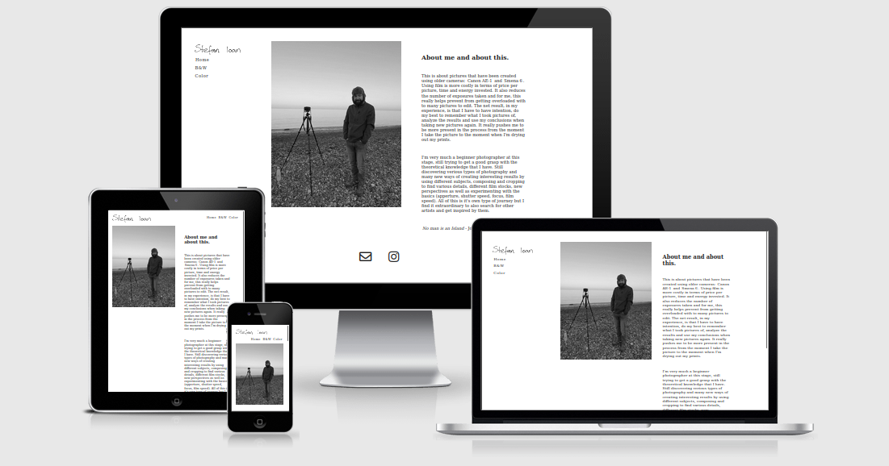
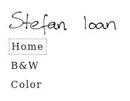
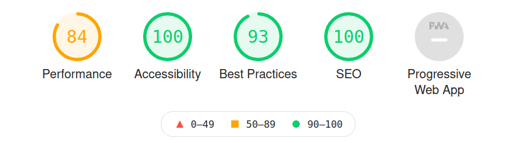

# Film Photography
This is a website about my film photography experience.

The goal is to share images with others. These are representative of my journey in the photography world. I'm also sharing my thoughts about these images, hoping that the users get a glimpse into the relationship between the intention and the end result. 

[Live link](https://kaospctqc.github.io/film_photography/index.html)

As a design feature, this website should be easy to browse on a number of devices and screen sizes.

## Features
The website currently showcases images and a short description/idea for each image.
### Existing features
- __Navigation Menu__
    - Present on all the pages of the project, contains links to Home, B&W and Color page and is the same on all pages. In the layout for bigger screens, it keeps it's place relative to the viewport even when scrolling so that navigation is readily available.
    - There is a border around the link that shows the current page that the user is on.
    - This menu should enable website navigation and remove the need for the 'back' button of the web browser.

    
- __Landing Page (Home page) image__
    - Provides the information that this website contains my photography portfolio. Creates the correct expectations.
- __Landing Page description__   
    - The purpose is to convey context to the rest of the information contained in the website. Set the stage.
- __Footer__
    - Provides a couple of links to enable communication using email and a social media platform. This is available on all pages.
- __Images pages - B&W and Color__
    - The images pages share a sequence of images together with the idea from the image or about the image.
    - There is a progression that can be followed and each image shares some aspect of photography that I believed to be worth sharing.
    - Most of the images share the same square aspect ratio. This choice was deliberate and helped focus the content of the image and identify the interest.
    - Some images are not in this square format because I feel that the subject wouldn't have been represented correctly.
### Future features
- __Equipment page__
    - I'd like to create a page to describe the equipment used and it's impact on the workflow and the end result.
    - The focus will be more on how the equipment changes the approach and flow while shooting a roll of film instead of the technical specs since these can be easily found in other places.
- __Click to zoom__
    - I feel that the users will benefit from being able to view a bigger, higher resolution image. 
    - This can be implemented so that when a user clicks on a image, a overlay with a bigger image can be presented. 
    - On a second click, this overlay dissapears and the users is back at the previous screen.
- __Back to Top__
    - Since the content is arranged veritcally and the height is very large, a floating button that is able to take the user back to the top should help navigate, especially in lower resolutions or smaller screen sizes.
## Testing

Manual testing has been performed in order to identify issues regarding the websites: functionality and responsiveness.

### Testing for responsiveness
- I've changed my browser window width in order to simulate different resolutions and identify at which point the website elements begin to overlap or become more difficult to identify.
- After implementing css rules in order to handle these different displa sizes/resolutions, I've requested a peer review and have received valuable feedback that pointed to smaller screens than ones I had anticipated that were having a issue with the menu becoming difficult to read.
- Following the previous testing process I have found that I need to change css rules at the following widths: 1310px, 1000px, 720px and 400px

### Testing for functionality
- I've used different devices to browse the website and follow all the links.

### Unfixed bugs
- I've found that on some mobile devices, following a link from the menu, we navigate to the expected page but we do not land at the top of the page, instead we are a little lower in the page. This is less than ideal behaviour but this does not prevent the user from using the website and should be marked as a future improvement.

### Testing tools:
- For testing HTML I have used this tool and have not seen any errors: [W3C HTML Validator](https://validator.w3.org/nu/?doc=https%3A%2F%2Fkaospctqc.github.io%2Ffilm_photography%2Findex.html)
- For testing CSS I have used this tool and have not seen any errors: [W3C CSS Validator](https://jigsaw.w3.org/css-validator/validator?uri=https%3A%2F%2Fkaospctqc.github.io%2Ffilm_photography%2Findex.html&profile=css3svg&usermedium=all&warning=1&vextwarning=&lang=en)
- For responsiveness I have found this tool which gives a visual representation of different devices of various screen sizes: [Am I Responsive?](http://ami.responsivedesign.is/?url=https%3A%2F%2Fkaospctqc.github.io%2Ffilm_photography%2Findex.html)
- Checking Best Practices: Browser add-on for Firefox: Lighthouse

## Deployment

The website was deployed using [GitHub](https://github.com/).
- Login to GitHub
- Navigate to your respoitory containg the website you wish to publish.
- Click on "Settings" from the horizontal menu
- Select "Pages" from the vertical menu
- Select the desired branch (usually "master" or "main")
- After clicking "Save" you should see a refresh and the link for accessing the website is now available.

## Credits

Both Content (text) and Media (Images) have been created by me. 

Design has been inspired by other photography websites. After searching for examples of other photo portfolios and selecting the ones that I liked, I have found that they are potentially using a [Squarespace](https://www.squarespace.com) template. I have used the visual design found in these websites and have looked into how they accomplish various features.
This is a short list of websites that share a similar design:
- [Jen Huang Bogan](https://jenhuangphoto.com/)
- [Pedro N the world](https://www.pedrontheworld.com/overview)
- [Mike Kelley](https://www.mpkelley.com/)